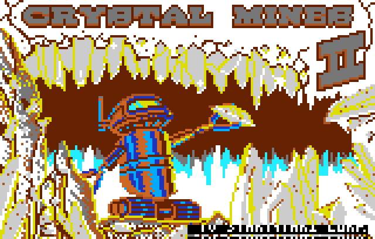

# crystalmines2-lynx-recomp

**A static recompilation of *Crystal Mines II* (Atari Lynx, 1992) — the second
game brought up on [`lynxrecomp`](https://github.com/sp00nznet/lynxrecomp).**



*The image above is rendered by the recompiled C — Crystal Mines II's 65SC02
code translated to native C and executed directly (no interpreter), driving the
emulated Suzy blitter.*

*Crystal Mines II* is a Boulder-Dash-style maze game: dig through caverns,
collect crystals, dodge and outwit creatures, and reach the exit across many
levels. It was the **second** title brought up on the toolkit — chosen precisely
because it's a *different* game (different studio, different code, a different
entry point and interrupt layout than Chip's Challenge) and so proves the
recompiler **generalizes**.

This repository is the reference game: it pulls in `lynxrecomp` as a submodule,
adds the host that runs the recompiled C, and builds a native executable.

> **No ROM here.** The cartridge dump and the recompiler-generated C (derived
> from it) are not committed. Supply your own
> `Crystal Mines II (USA, Europe).lnx` — sha1 `c3b7e7fe892068bf4b58aec85181f6b00693b47d`.

## Generalization — what carried over for free

Bringing up Crystal Mines II needed **zero changes to the toolkit** — only this
game's own entry point and dispatch seeds. Out of the box:

- The boot decrypt handled CM2's loader (150 bytes / 3 blocks, vs Chip's
  Challenge's 250 / 5) with no changes.
- `lynxexec` booted it to its game entry **`$5259`** (Chip's was `$18B7`); its
  IRQ vector is `$60EB` (Chip's was `$1C40`) — all discovered generically.
- Discovery + emit produced **~220 functions, zero dispatch gaps** after
  seed-closure; the recompiled C runs and renders the title screen.

The toolkit since gained **save states** and an optional **SDL2 + Dear ImGui
frontend** (window, audio, input, menu, ComLynx multiplayer) — see the toolkit's
[`docs/FRONTEND.md`](https://github.com/sp00nznet/lynxrecomp/blob/main/docs/FRONTEND.md);
this game can adopt that host for live play.

## Build & run

You need the toolkit (built from the submodule), your cart dump, and the Lynx
boot ROM (`lynxboot.img`).

```powershell
git clone --recurse-submodules https://github.com/sp00nznet/crystalmines2-lynx-recomp
cd crystalmines2-lynx-recomp
cmake -S . -B build && cmake --build build --config Release
$T = "build/lynxrecomp/tools/m65c02recomp/Release"

# 1. boot to a post-init RAM image
& $T/lynxrun.exe --snapshot "Crystal Mines II (USA, Europe).lnx" lynxboot.img ram.bin 60

# 2. recompile, seeding the computed-jump targets (no gaps)
& $T/m65c02recomp.exe recompbin ram.bin 0x0000 games/crystalmines2/generated `
    0x5259 0x5757 0x56C6 0x56CF 0x042B 0x051A

# 3. rebuild against the generated C, then run
cmake --build build --config Release
& build/games/crystalmines2/Release/crystalmines2.exe ram.bin 400 title.ppm
```

If the host reports any unrecompiled-address gaps, add them as seeds in step 2
and repeat (iterative seed-closure).

## Credits

The recompiler, runtime, and host are original — see
[`lynxrecomp`'s credits](https://github.com/sp00nznet/lynxrecomp#credits--references)
for the prior Lynx reverse-engineering this builds on. The `lynxboot.img` boot
ROM is Atari's copyright and is **not** shipped here.

## License

MIT — see [`LICENSE`](LICENSE). *Crystal Mines II* is © its respective owner;
this project ships **no game data** — the screenshot is a render shown for
documentation under fair use, and the recompiler-generated C is not committed.
Independent, non-commercial preservation/recompilation work.
